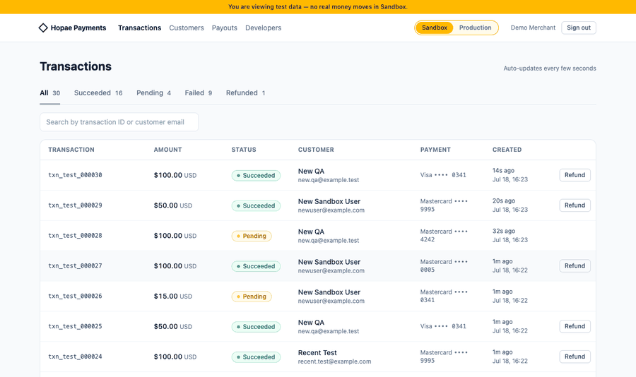
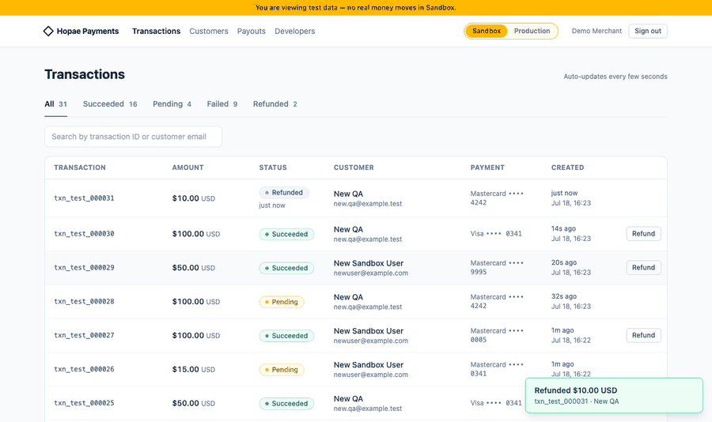
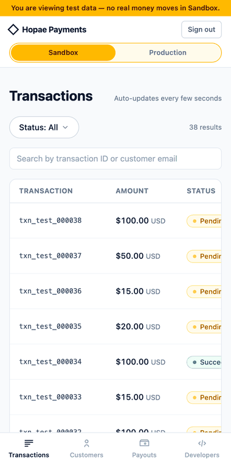

# Hopae Payments — 어드민 콘솔 (Take-home 제출)

가맹점이 결제 내역을 확인하고 환불하는 어드민 콘솔입니다. 과제 안내대로
**트랜잭션 목록/환불 API를 라우트·DTO 설계부터 직접 구현**하고, 그 위에
React 프론트엔드를 얹었습니다.

| 준실시간 갱신 + 환불 | 환경 전환 (Sandbox ↔ Production) |
| --- | --- |
|  |  |

준실시간 GIF에서 목록을 아래로 스크롤해도 상단에 **"↑ N new transactions"
pill**이 떠 있는 것 — 신규는 이 pill로만 알리고 목록은 스스로 밀리지 않습니다.
환경 전환 GIF는 노란 테스트 배너의 유무와 **Production 환불의 "real money"
체크박스 게이트**(체크 전 버튼 비활성)를 보여줍니다.

<details>
<summary>모바일 — 하단 탭바 + 상태 필터 바텀시트</summary>



</details>

개별 스크린샷은 [`docs/demo/`](docs/demo/)에 있습니다.

---

## 1. 실행 방법

Node 18+ 기준입니다. 터미널 두 개로 실행합니다.

```bash
# 터미널 1 — mock 서버 (:4000)
cd mock-server
npm install
npm start

# 터미널 2 — 웹 앱 (:5173)
cd web
npm install
npm run dev
```

- 접속: http://localhost:5173 → 로그인 `demo@hopae.com / password123`
- 웹 dev 서버가 `/api`를 `:4000`으로 프록시하므로 별도 설정이 필요 없습니다.
- 테스트: `mock-server`와 `web` 각각에서 `npm test` (서버 13개 + 프론트 6개).

---

## 2. 기술 스택과 선택 이유

| 선택 | 이유 |
| --- | --- |
| **Vite + React + TypeScript** | 과제 범위(SPA 콘솔)에 SSR이 줄 이점이 없어 Next.js 대신 가장 가벼운 구성을 택했습니다. |
| **TanStack Query** | 이 과제의 핵심 난제인 *폴링 · 캐시 무효화 · 페이지네이션 · 뮤테이션 후 캐시 패치*가 전부 이 라이브러리의 본업입니다. 전역 상태 라이브러리는 별도로 쓰지 않았습니다 — 서버 상태는 Query가, 나머지(env·필터)는 URL이 들고 있어서 남는 전역 상태가 없습니다. |
| **react-router** | env를 URL 경로로 쓰기 위해 필요합니다(아래 §4-2). |
| **Tailwind CSS v4** | UI 킷(shadcn 등) 없이 손으로 작성했습니다. 컴포넌트 수가 적어 킷 도입 비용이 더 크다고 판단했고, 마크업이 전부 코드에 드러나는 편이 리뷰에도 낫다고 봤습니다. |
| **vitest** | 서버(쿼리/환불 로직)와 프론트(금액 포맷) 순수 함수 테스트. |

---

## 3. 백엔드 API 설계 (`mock-server/routes/transactions.ts`)

### 3-1. 목록 — `GET /api/transactions`

```
GET /api/transactions?env=sandbox&status=failed&q=ada@&limit=25&cursor=…
```

| 파라미터 | 설명 |
| --- | --- |
| `env` (필수) | `sandbox` \| `production` |
| `status` | 상태 필터 |
| `q` | 트랜잭션 ID · 고객 이메일 부분 일치 (대소문자 무시) |
| `limit` | 1–100, 기본 20 |
| `cursor` | 이 커서보다 **오래된** 항목 반환 (다음 페이지) |
| `max` | 이 커서 **이하** 항목만 반환 (윈도우 앵커 — §4-3) |
| `since` | 이 커서보다 **새로운** 항목 반환 (신규 폴링 — §4-3) |

응답:

```jsonc
{
  "data": [ /* TransactionRow — 아래 DTO */ ],
  "page_info": { "next_cursor": "…", "has_more": true, "limit": 25 },
  "window_max": "…",   // 반환된 가장 최신 항목의 커서. 클라이언트가 max로 되돌려줌
  "summary": { "total": 91, "succeeded": 61, "pending": 10, "failed": 17, "refunded": 3 }
}
```

**왜 offset이 아니라 cursor인가.** 이 서버는 몇 초마다 목록 맨 앞에 새
트랜잭션을 `unshift`합니다. offset 페이지네이션이면 1페이지를 읽고 2페이지를
요청하는 사이에 행이 밀려 **중복/누락**이 생깁니다. 커서를 값 기반
`(created_at, id)` 위치로 정의하면 삽입과 무관하게 페이지 경계가 고정됩니다.
커서는 base64url로 감싼 불투명 문자열이라 내부 표현을 바꿔도 클라이언트가
깨지지 않습니다.

**`max` / `since`를 추가한 이유.** 준실시간 갱신 전략(§4-3)의 서버측 절반입니다.
`max`는 "이 시점 이후의 신규는 끼워넣지 말 것"(윈도우 고정), `since`는 "이 시점
이후 신규만 셀 것"(배너 카운트)을 표현합니다. 같은 엔드포인트의 파라미터로 둬서
필터·검색 조건이 목록/폴링에 자동으로 동일하게 적용됩니다.

**`summary`를 매 응답에 포함.** 상태 탭에 라이브 카운트를 달기 위해서입니다.
의도적으로 *검색(q)은 적용하고 상태 필터는 적용하지 않은* 카운트입니다 —
"failed 탭을 보면서도 다른 상태가 몇 건인지" 보이도록. 데이터가 인메모리
수백 건이라 매번 세는 비용은 무시할 수준입니다.

**Row DTO는 트림된 형태.** 목록에는 `events` 타임라인이 필요 없어 제외하고,
`failure_reason`(failed일 때) · `refunded_at`(refunded일 때)만 평탄화해서
내려줍니다. 5초마다 폴링하는 페이로드라 작게 유지했습니다.

### 3-2. 환불 — `POST /api/transactions/:id/refund`

```
POST /api/transactions/:id/refund   body: { "env": "sandbox" }
```

- 성공: `200 { transaction }` — 갱신된 행을 그대로 돌려줘서 클라이언트가
  전체 refetch 없이 캐시를 패치할 수 있습니다.
- `404 not_found` — 해당 env에 없는 ID
- `409 already_refunded` / `409 not_refundable` — **응답에 현재 `transaction`을
  함께 실어** 클라이언트가 낡은 행을 즉시 최신 상태로 교체할 수 있게 했습니다.

**환불 모델링.** 별도 refund 리소스를 만드는 대신 트랜잭션의 상태 전이
(`succeeded → refunded`) + `events`에 `refunded` 이벤트 추가로 모델링했습니다.
부분 환불·복수 환불이 스코프에 없으므로 Stripe식 refund 객체는 과설계라고
판단했습니다(한계는 §7에 명시). 환불 가능 조건은 `succeeded`뿐입니다 —
`pending`은 아직 캡처 전, `failed`는 청구된 돈이 없기 때문입니다.

**동시성.** 환불 API는 멱등에 가깝게 동작합니다: 이미 환불된 건을 다시
환불하면 409 + 현재 상태를 돌려주므로, 두 관리자가 동시에 눌러도 두 번
환불되지 않고 늦은 쪽 화면이 최신 상태로 수렴합니다.

---

## 4. 프론트엔드 의사결정

### 4-1. 인증

- 토큰은 `localStorage`에 저장(mock 토큰은 만료가 없고 과제 포커스가 아니므로
  단순하게). API 래퍼가 모든 요청에 Bearer를 붙이고, **401이면 세션을 지우고
  `/login?reason=session`으로 보냅니다** — 로그인 화면에 "세션이 끝났다"는
  안내가 뜹니다.
- 미인증 상태로 딥링크 접근 시 로그인으로 보내되 **원래 목적지를 쿼리까지
  포함해 기억**했다가 로그인 후 그대로 복귀합니다
  (`/production/transactions?status=failed` → 로그인 → 같은 화면·같은 필터).
- 로그인 실패(401)는 "Invalid email or password", 서버 다운은 "mock 서버가
  실행 중인지" 안내로 구분해서 보여줍니다.

### 4-2. 환경(env) 상태는 URL 경로에

`/sandbox/transactions`, `/production/transactions` — env를 전역 상태가 아니라
**URL 세그먼트**로 두었습니다. 이유:

- 새로고침·딥링크·뒤로가기에서 환경이 유지/복원됩니다. "Production을 보고
  있는 줄 알았는데 리셋돼서 Sandbox였다"는 사고 유형 자체가 사라집니다.
- 필터(`?status=…&q=…`)도 URL 쿼리에 있어서 **현재 보고 있는 화면 전체가
  공유 가능한 주소**가 됩니다.
- 스위처는 경로만 치환하므로 필터를 유지한 채 환경만 바뀝니다. 검색어는
  env 전환 시 의도적으로 초기화합니다(테스트 고객 이메일을 Production에서
  검색하는 건 대부분 실수라고 봤습니다).

**환경별 UX 차등** — "실수로 Production을 건드리는 것"을 막는 데 집중했습니다:

| | Sandbox | Production |
| --- | --- | --- |
| 상단 배너 | 노란 "You are viewing test data" 상시 노출 | 없음 |
| 스위처 스타일 | 노란(주의색) 강조 | 어두운 무채색 |
| 환불 확인 | 버튼 1클릭 (테스트 돈) | **"real money" 체크박스를 켜야 버튼 활성화** |
| 빈 상태 문구 | "Make a test charge…" | "Live payments will appear…" |

### 4-3. 준실시간 갱신 — 이 과제의 핵심 설계

**요구 충돌**: 목록은 계속 최신이어야 하지만, 사용자가 읽고 있는 행이
멋대로 밀리면 안 됩니다(환불 버튼을 누르려는 순간 행이 이동하는 최악의 UX).

**열쇠는 "최신"과 "안 밀림"이 충돌하는 변화가 한 종류뿐이라는 것.** 목록에
일어나는 변화는 둘로 나뉩니다:

1. **기존 행의 상태 변화** (`pending → succeeded/failed`) — 행 크기·위치가
   그대로고 내용만 바뀝니다. 실시간 반영해도 아무것도 밀리지 않으므로
   **즉시·자동 반영**합니다.
2. **새 행 삽입** — 유일하게 레이아웃을 미는 변화. 이것만 자동 반영을
   포기하되, "새로 N건 생겼다"는 **사실 자체는 배너로 실시간 통지**하고
   목록에 반영되는 *타이밍*의 결정권만 사용자에게 넘깁니다.

검토한 대안과 탈락 이유:

| 대안 | 탈락 이유 |
| --- | --- |
| 주기적 전체 리로드 | 새 행이 위에 꽂히며 전체가 밀림 → 클릭 직전 행 이동으로 **다른 트랜잭션을 환불하는 오클릭** 가능. 돈이 걸린 콘솔에서 허용 불가 |
| 수동 새로고침만 | 안전하지만 "뭔가 바뀌었는지조차 모름" → 준실시간 요구 미달, pending 확인에 새로고침 연타 강요 |
| **변화 종류별 분리 (채택)** | 정보의 최신성은 100% 유지(상태 변화 즉시 + 신규 건수 즉시 통지), 레이아웃 변경만 사용자 클릭에 묶음 |

**구현: "앵커된 윈도우 + 신규 배너 + 제자리 갱신"** (Gmail/Twitter/Linear 패턴)

1. 첫 페이지 로드 시 서버가 준 `window_max` 커서로 목록을 **앵커**합니다.
   이후 모든 페이지 요청·백그라운드 refetch에 `max=anchor`가 붙으므로,
   **로드된 윈도우에는 새 항목이 절대 끼어들지 않습니다.**
2. 5초마다 로드된 페이지들을 조용히 refetch합니다. 윈도우가 고정돼 있으니
   행 위치는 그대로고 **내용만** 바뀝니다 — `pending → succeeded/failed`
   전이가 제자리에서 배지 색 변화 + 1.6초 하이라이트로 표시됩니다.
3. 별도의 가벼운 폴링이 `since=anchor`로 신규 항목 수를 세서
   **"↑ N new transactions"** pill을 띄웁니다. 이 pill은 **sticky**라
   목록을 아무리 내려도 화면 상단에 계속 떠 있습니다 — 신규 알림은
   목록 맨 위에 있는데 사용자는 아래를 보고 있어서 놓치는 상황을 막기
   위한 결정입니다(트위터/X의 "new posts" 패턴). 클릭하면 최상단으로
   스크롤하며 앵커를 풀고 최신 헤드부터 다시 로드 — 목록이 바뀌는
   순간이 항상 *사용자가 시작한 순간*이 되도록.
4. 페이지네이션은 "Load more" 버튼(25개씩). 백그라운드 삽입이 계속되는
   중에도 커서 덕분에 **중복·누락 없이** 이어집니다(테스트로 검증).

**왜 SSE/WebSocket이 아니라 폴링인가.** 판단 기준 세 가지:

1. **요구가 "준실시간"이지 실시간이 아닙니다.** 서버의 데이터 변화 주기
   자체가 6초(tick)라 5초 폴링이면 push와 체감 차이가 없습니다.
2. **push를 붙여도 일이 줄지 않습니다.** 이벤트가 0초에 오든 5초에 오든
   "언제 어떻게 목록에 반영할지"(위 갱신 정책)는 똑같이 필요합니다. 이
   과제의 본질은 전송 방식이 아니라 갱신 정책이라고 판단했습니다.
3. **비용 대비 이득.** SSE는 재연결 시 놓친 이벤트를 메꾸는 catch-up이
   필요한데, 그게 결국 "커서 이후 변경분 조회" — 지금의 `since` 폴링과 같은
   코드입니다. 폴링을 먼저 완성하면 SSE 전환은 트리거 교체 문제가 됩니다.
   (WebSocket은 클라이언트→서버 실시간 송신이 없는 이 콘솔에는 오버스펙.)

실서비스에서 수천 가맹점이 콘솔을 상시 열어두는 규모가 되면 폴링 부하가
문제가 되므로 그때는 SSE + 커서 catch-up이 정석입니다 — 전송만 교체하면
되는 구조로 남겨뒀습니다.

**구현하며 잡은 엣지케이스** (전부 실제 브라우저 조작으로 발견·수정·재검증):

- **탭 전환 시 카운트가 과거로 출렁** — 앵커 전환 후에도 비앵커(`null`) 키
  캐시에 *페이지 최초 로드 시점 스냅샷*이 남아, 필터 복귀 시 그 스냅샷이
  먼저 보였다가 refetch로 돌아오는 문제. → 앵커 확정 시 해당 캐시를 제거.
- **배너 클릭이 옛 윈도우로 스냅백** — `keepPreviousData`의 placeholder가
  이전 앵커의 `window_max`를 노출해 재앵커가 과거로 잡히는 문제. →
  placeholder 데이터로는 앵커를 잡지 않도록 가드.
- **필터 전환 시 전체 행이 플래시** — 변화 하이라이트 추적기가 필터로 갈린
  행들을 "신규"로 오인 + placeholder 행을 베이스라인으로 오인(2중 원인).
  → 필터 키 변경 시 추적기 리셋 + 실데이터 도착 시점에 조용히 베이스라인.
- **백그라운드 탭에서 갱신 정지** — TanStack Query는 창이 포커스를 잃으면
  `refetchInterval`을 멈춥니다. 어드민 콘솔은 보조 모니터에 떠 있는 경우가
  많아 `refetchIntervalInBackground: true`로 상시 갱신을 유지했습니다.
- **모바일에서 하단 탭바가 화면 밖으로** — 모바일 Chrome은
  `overflow-x-auto` 컨테이너 *안*에 있는 넓은 테이블(`min-width: 880px`)을
  보고도 **레이아웃 뷰포트 자체를 882px로 확장**(자동 축소)해버려, `fixed`
  요소가 그 확장된 뷰포트 기준으로 배치되며 화면 밖으로 밀렸습니다. "탭바 숨기기"와
  "테이블 min-width 제거"를 각각 실험해 원인을 테이블로 격리했고,
  viewport meta에 `minimum-scale=1`(뷰포트 확장 차단, 핀치 줌인은 유지)을
  추가해 해결했습니다.

**필터·검색은 서버에서.** pagination이 서버에 있는 이상 필터·검색도 서버에
있어야 결과가 완전합니다(클라이언트 필터링은 "로드된 페이지 안에서만" 검색하는
반쪽짜리가 됩니다). 검색창은 300ms 디바운스 후 URL과 쿼리에 반영됩니다.

### 4-4. 환불 플로우의 경합 처리

- 확인 모달은 캐시의 **살아있는 행**에 바인딩됩니다 — 모달이 열려 있는 동안
  백그라운드 refetch로 행이 갱신되면 모달 내용도 따라갑니다.
- 확정 시 낙관적 업데이트를 **쓰지 않고** 서버 응답의 행으로 캐시를
  패치합니다. 결제 도메인에서 "환불됐다고 보여줬다가 되돌리는" 것은
  최악이므로, 응답 지연 동안 버튼 스피너로 처리했습니다.
- 409(이미 환불됨 등)가 오면 응답에 실린 현재 상태로 행을 교체하고
  토스트로 사유를 알립니다 — 사용자는 항상 진실과 마주합니다.
- 성공 후 `invalidateQueries`로 summary 카운트까지 재동기화합니다.

### 4-5. 금액 표시

`Intl.NumberFormat` 기반이며, **KRW/JPY는 minor unit이 없으므로 100으로
나누지 않습니다** (`₩12,000`, `¥2,150` — 테스트로 고정). 나머지 통화는
센트 → 소수 둘째 자리 표시.

---

## 5. 상태별 UX 처리

| 상태 | 처리 |
| --- | --- |
| 로딩 | 스켈레톤 행 (첫 로드만; 이후 갱신은 깜빡임 없이 조용히) |
| 에러 (최초 로드) | 테이블 영역에 메시지 + "Try again" (서버 다운 안내 별도 문구) |
| 에러 (갱신 실패) | **로드 실패와 구분해서 처리** — 이미 데이터가 있으면 목록을 지우지 않고 유지한 채 "Can't reach the server — showing the last loaded data. Retrying automatically…" 배너만 표시. 폴링이 계속 돌므로 서버가 돌아오면 **수동 조작 없이 자가 복구** (서버를 실제로 껐다 켜서 검증) |
| 빈 상태 | 데이터 자체가 없음 vs 필터 결과 없음("Clear filters" 버튼)을 구분 |
| 갱신 | 상태 변화·신규 행에 1.6초 하이라이트, 우상단 "Refreshing…" 인디케이터 |
| 정보 노출 | 실패 사유·정확한 생성/환불 시각을 호버 뒤에 숨기지 않고 **상시 표시** (호버 툴팁은 발견성이 없어 배제) |
| 반응형 | 테이블은 어떤 화면에서도 **그대로 유지**(`min-width` + 가로 스크롤 — 결제 대사 화면은 컬럼 정렬이 곧 가독성). 대신 테이블 밖 요소를 모바일 문법으로 재배치: 헤더 2행(2행째는 **풀폭 환경 스위처** — 핵심 컨트롤을 엄지 존에), **하단 탭바**(주 내비게이션 — 상단 텍스트 네비는 데스크톱 전용), 검색·Load more 풀폭 터치 타겟 |
| 모바일 상태 필터 | 데스크톱은 라이브 카운트가 달린 언더라인 탭, 모바일은 **바텀시트**. 후보 비교: ① 가로 스크롤 탭 — 항목이 5개 고정인데 마지막(Refunded)이 잘려 발견성 손실, ② 드롭다운 — 카운트 글랜스 상실 + 조작 2탭, ③ 칩 랩 — 2~3줄로 흘러 정돈감 손실. 바텀시트는 평소 한 줄("Status: All" 필 + 현재 결과 건수)로 끝나고, 선택 시엔 풀폭 터치 로우 + 카운트 + 체크가 열립니다(백드롭/Esc 닫기, 스크롤 락, reduced-motion 대응). 카운트 표기는 컴팩트(15514 → 15.5K, 정확값은 툴팁) |
| 접근성/품질 지표 | Lighthouse(프로덕션 빌드, 모바일 에뮬레이션): **Performance 100 · Accessibility 100 · Best Practices 100** (SEO 63은 어드민 콘솔에 의도적으로 넣은 `robots.txt Disallow` 때문 — 결제 콘솔은 크롤링되면 안 됩니다). 로그인 후 대시보드는 axe-core 검사 **위반 0건** (대비 부족 텍스트·랜드마크 누락을 찾아 수정) |
| 성공/실패 피드백 | 토스트 (환불 성공 / 409 / 네트워크 오류) |
| 가딩 | 미인증 → `/login` 리다이렉트(원래 목적지 기억), 잘못된 env URL → sandbox로, 잘못된 쿼리 파라미터 → 서버 400 + 명확한 메시지 |

접근성: 모달 `role=dialog` + Esc 닫기 + 포커스 이동, 토스트 `aria-live`,
스위처 `role=radiogroup`, 상태 탭 `role=tablist`.

---

## 6. 제공 파일 수정 내역

- `mock-server/routes/transactions.ts` — 과제 본문(전면 구현).
- `mock-server/package.json` — devDependency로 `vitest`, `test` 스크립트 추가.
- 그 외 제공 파일(`lib/auth.ts`, `lib/store.ts`, `server.ts`, `types.ts`)은
  수정하지 않았습니다.

## 7. 의도적으로 단순화/생략한 것, 시간이 더 있다면

- **부분 환불 / refund 객체 분리** — 요구사항이 전액 환불이라 상태 전이로
  모델링했습니다. 부분 환불이 생기면 `refunds[]` 서브리소스로 분리하고
  `status` 대신 `amount_refunded`를 도입하는 게 맞습니다.
- **트랜잭션 상세 화면** — 와이어프레임에 없고 핵심 플로우가 아니라고
  판단해 뺐습니다. `events` 타임라인은 상세 화면용 데이터인데, DTO에서
  제외한 것도 같은 판단입니다. 추가한다면 행 클릭 → 사이드 패널 형태로.
- **SSE 전송** — §4-3 참고. 갱신 정책은 그대로 두고 전송만 교체 가능한 구조.
- **커서의 암호화/서명** — mock이라 base64 인코딩만 했습니다. 실서비스라면
  변조 방지 서명을 붙입니다.
- **E2E 테스트** — 데모 캡처를 puppeteer 스크립트로 자동화해 두긴 했지만,
  정식 Playwright E2E(배너 → 클릭 → 목록 갱신 시나리오)를 추가하고 싶습니다.
- **가상 스크롤** — 수천 행을 "Load more"로 계속 쌓으면 DOM이 무거워집니다.
  현재 스코프(수백 건)에서는 불필요하다고 판단했습니다.
